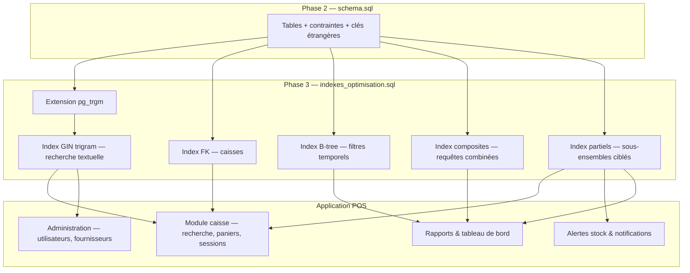
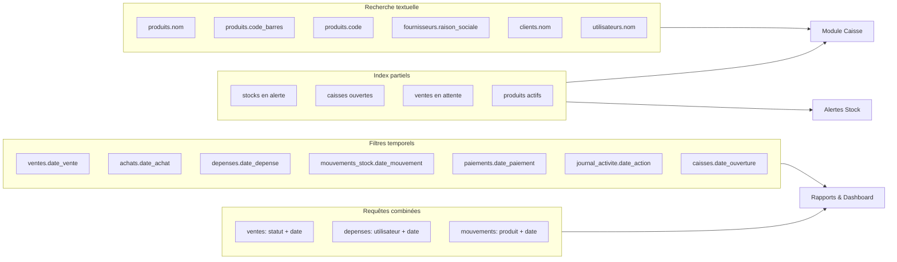
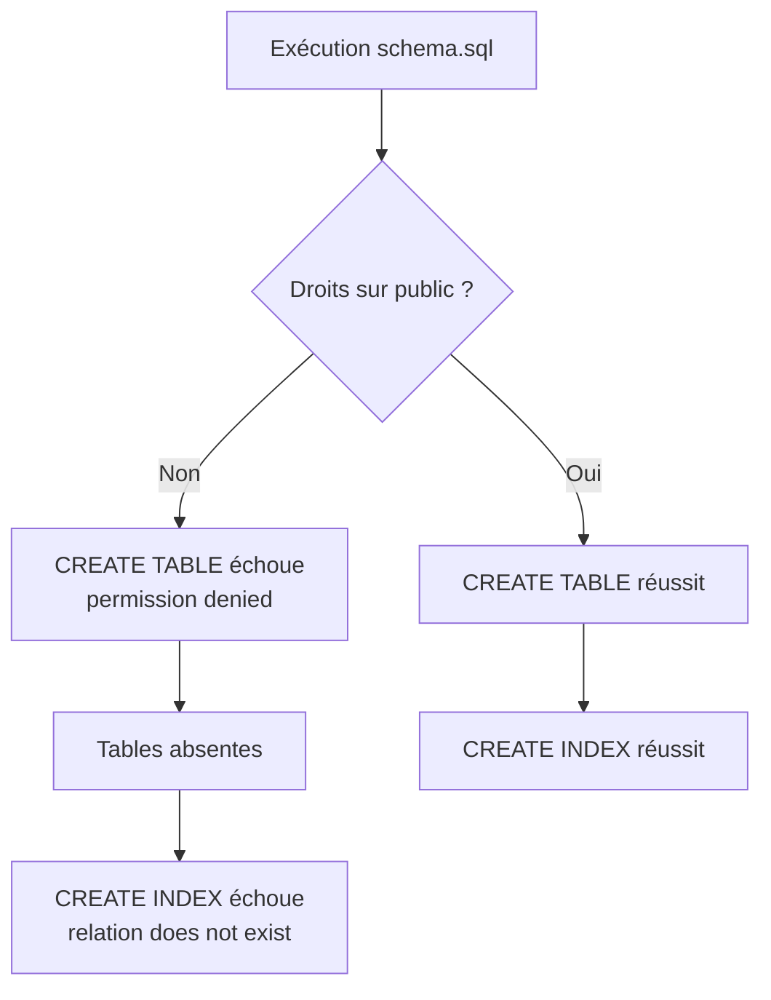
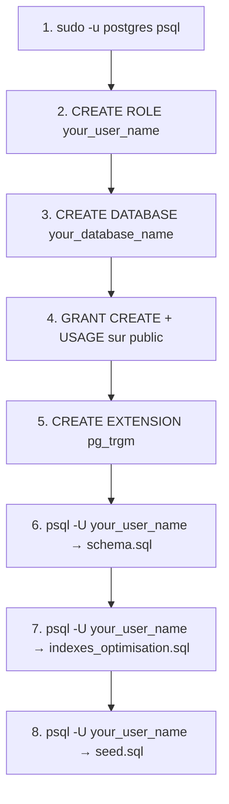

# Documentation — Indexation et optimisation PostgreSQL

**Projet :** Application POS — Débits de Boissons  
**Fichier source :** `database/indexes_optimisation.sql`  
**Phase :** 3 — Indexation et optimisation  
**Prérequis :** exécution préalable de `database/schema.sql` (Phase 2)

---

## Table des matières

1. [Vue d'ensemble](#1-vue-densemble)
2. [Contexte et positionnement](#2-contexte-et-positionnement)
3. [Procédure d'exécution](#3-procédure-dexécution)
4. [Architecture du script](#4-architecture-du-script)
5. [Section 0 — Extension pg_trgm](#5-section-0--extension-pg_trgm)
6. [Section 1 — Index sur clé étrangère](#6-section-1--index-sur-clé-étrangère)
7. [Section 2 — Index de recherche textuelle](#7-section-2--index-de-recherche-textuelle)
8. [Section 3 — Index sur les filtres temporels](#8-section-3--index-sur-les-filtres-temporels)
9. [Section 4 — Index composites](#9-section-4--index-composites)
10. [Section 5 — Index partiels](#10-section-5--index-partiels)
11. [Récapitulatif des index](#11-récapitulatif-des-index)
12. [Schéma récapitulatif](#12-schéma-récapitulatif)
13. [Concepts PostgreSQL utilisés](#13-concepts-postgresql-utilisés)
14. [Bonnes pratiques et maintenance](#14-bonnes-pratiques-et-maintenance)
15. [Dépannage — erreurs PostgreSQL rencontrées](#15-dépannage--erreurs-postgresql-rencontrées)

---

## 1. Vue d'ensemble

Le fichier `indexes_optimisation.sql` est un **script complémentaire** au schéma relationnel défini dans `schema.sql`. Il ne crée ni ne modifie de tables : son unique rôle est d'ajouter des **index PostgreSQL** ciblés sur les requêtes les plus fréquentes d'une application de point de vente (POS) pour débits de boissons.

### Objectifs


| Objectif                | Description                                                                       |
| ----------------------- | --------------------------------------------------------------------------------- |
| **Performance**         | Réduire le temps de réponse des requêtes critiques (caisse, rapports, alertes)    |
| **Recherche textuelle** | Accélérer les barres de recherche avec correspondance partielle (`ILIKE '%mot%'`) |
| **Rapports temporels**  | Optimiser les filtres par plage de dates sur les tables à forte volumétrie        |
| **Requêtes métier**     | Couvrir les cas d'usage documentés dans les spécifications fonctionnelles (§5.x)  |


### Caractéristiques du script

- **Idempotent** : toutes les instructions utilisent `CREATE INDEX IF NOT EXISTS` et `CREATE EXTENSION IF NOT EXISTS`, ce qui permet de relancer le script sans erreur.
- **Non destructif** : aucune suppression de données ni modification de schéma.
- **Documenté** : chaque bloc d'index est commenté avec le cas d'usage métier associé.

---

## 2. Contexte et positionnement

Le projet suit une progression en phases :

```
Phase 2 — schema.sql
    └── Création des tables, contraintes, clés étrangères, types

Phase 3 — indexes_optimisation.sql  ← ce document
    └── Ajout des index de performance

Phase ultérieure — seed.sql
    └── Données de démonstration / initialisation
```

Le schéma initial (`schema.sql`) définit la structure relationnelle complète : rôles, utilisateurs, produits, stocks, ventes, achats, caisses, etc. Certaines optimisations n'y sont pas incluses volontairement, afin de séparer la **modélisation des données** (Phase 2) de l'**optimisation des performances** (Phase 3).

### Pourquoi un fichier séparé ?

1. **Lisibilité** : le schéma DDL reste focalisé sur la structure ; les index sont regroupés et commentés par cas d'usage.
2. **Évolutivité** : de nouveaux index peuvent être ajoutés sans toucher au schéma de base.
3. **Déploiement flexible** : en développement, on peut recréer le schéma sans réappliquer immédiatement tous les index ; en production, les index sont appliqués une fois les données présentes.

---

## 3. Procédure d'exécution

### Ordre obligatoire

Les tables doivent exister **avant** la création des index. L'ordre d'exécution recommandé est :

```bash
# 1. Créer le schéma (tables, contraintes)
psql -U <utilisateur> -d <base> -f database/schema.sql

# 2. Appliquer les index d'optimisation
psql -U <utilisateur> -d <base> -f database/indexes_optimisation.sql

# 3. (Optionnel) Charger les données de démonstration
psql -U <utilisateur> -d <base> -f database/seed.sql
```

### Vérification après exécution

Pour lister les index créés par ce script :

```sql
SELECT indexname, tablename, indexdef
FROM pg_indexes
WHERE schemaname = 'public'
  AND indexname LIKE 'idx_%'
ORDER BY tablename, indexname;
```

Pour vérifier que l'extension `pg_trgm` est active :

```sql
SELECT * FROM pg_extension WHERE extname = 'pg_trgm';
```

---

## 4. Architecture du script

Le script est organisé en **cinq sections numérotées**, plus l'activation d'une extension :

```
indexes_optimisation.sql
│
├── 0. Extension pg_trgm
│       └── Prérequis pour les index GIN de recherche textuelle
│
├── 1. Index manquant sur clé étrangère
│       └── caisses.id_utilisateur
│
├── 2. Index de recherche textuelle (GIN + trigram)
│       ├── produits (nom, code_barres, code)
│       ├── fournisseurs (raison_sociale)
│       ├── clients (nom)
│       └── utilisateurs (nom)
│
├── 3. Index sur les filtres temporels (B-tree)
│       ├── ventes, achats, depenses
│       ├── mouvements_stock, paiements
│       ├── journal_activite, caisses
│
├── 4. Index composites (multi-colonnes)
│       ├── ventes (statut + date)
│       ├── depenses (utilisateur + date)
│       └── mouvements_stock (produit + date)
│
└── 5. Index partiels (sous-ensemble de lignes)
        ├── stocks en alerte
        ├── caisses ouvertes
        ├── ventes en attente
        └── produits actifs
```

---

## 5. Section 0 — Extension pg_trgm

### Code

```sql
CREATE EXTENSION IF NOT EXISTS pg_trgm;
```

### Rôle

L'extension **pg_trgm** (trigram) découpe les chaînes de caractères en triplets successifs de caractères. Par exemple, le mot `bière` produit les trigrammes :   `b`,  `bi`, `biè`, `ièr`, `ère`, `re` .

Cette décomposition permet à PostgreSQL de construire des index **GIN** efficaces pour les recherches de type :

```sql
WHERE nom ILIKE '%biè%'
WHERE code_barres ILIKE '%12345%'
```

### Sans pg_trgm

Sans cette extension, une requête `ILIKE '%mot%'` impose un **scan séquentiel** complet de la table : PostgreSQL compare chaque ligne une par une. Sur des catalogues de milliers de produits, cela devient lent.

### Avec pg_trgm + index GIN

PostgreSQL utilise l'index pour identifier rapidement les lignes dont les trigrammes correspondent, sans parcourir toute la table.

---

## 6. Section 1 — Index sur clé étrangère

### Code

```sql
CREATE INDEX IF NOT EXISTS idx_caisses_utilisateur
    ON caisses(id_utilisateur);
```

### Problème identifié

Dans `schema.sql`, la colonne `caisses.id_utilisateur` référence `utilisateurs(id_utilisateur)` via une contrainte de clé étrangère (`FOREIGN KEY`). Or **PostgreSQL n'indexe pas automatiquement les colonnes de clé étrangère**.

### Impact sans index

Les requêtes suivantes effectuent un scan complet de la table `caisses` :

```sql
-- Toutes les caisses d'un utilisateur donné
SELECT * FROM caisses WHERE id_utilisateur = 42;

-- Jointure caisses → utilisateurs
SELECT c.*, u.nom
FROM caisses c
JOIN utilisateurs u ON u.id_utilisateur = c.id_utilisateur;
```

### Impact avec index

L'index B-tree sur `id_utilisateur` permet une recherche en **O(log n)** au lieu d'un parcours linéaire de toutes les lignes.

### Cas d'usage métier

- Affichage de l'historique des sessions de caisse d'un caissier
- Vérification de l'existence d'une caisse ouverte pour un utilisateur (§5.18)
- Rapports par opérateur de caisse

---

## 7. Section 2 — Index de recherche textuelle

### Principe

Ces index utilisent le type **GIN** (Generalized Inverted Index) avec l'opérateur `gin_trgm_ops` fourni par `pg_trgm`. Ils sont optimisés pour les recherches **contenant** (`%texte%`), contrairement aux index B-tree classiques qui ne couvrent efficacement que les préfixes (`texte%`).

### Index créés


| Nom de l'index                         | Table          | Colonne          | Cas d'usage                                               |
| -------------------------------------- | -------------- | ---------------- | --------------------------------------------------------- |
| `idx_produits_nom_trgm`                | `produits`     | `nom`            | Autocomplétion et recherche rapide en caisse (§5.5, §5.9) |
| `idx_produits_code_barres_trgm`        | `produits`     | `code_barres`    | Scan douchette, saisie partielle du code-barres           |
| `idx_produits_code_trgm`               | `produits`     | `code`           | Recherche par code produit interne                        |
| `idx_fournisseurs_raison_sociale_trgm` | `fournisseurs` | `raison_sociale` | Recherche fournisseur dans le module achats               |
| `idx_clients_nom_trgm`                 | `clients`      | `nom`            | Recherche client (§5.11)                                  |
| `idx_utilisateurs_nom_trgm`            | `utilisateurs` | `nom`            | Gestion des comptes administrateur (§5.3)                 |


### Exemple de requête optimisée

```sql
-- Recherche produit en caisse (autocomplétion)
SELECT id_produit, nom, prix_vente
FROM produits
WHERE actif = TRUE
  AND nom ILIKE '%heine%'
ORDER BY nom
LIMIT 20;
```

L'index `idx_produits_nom_trgm` est utilisé pour filtrer rapidement les produits dont le nom contient `heine`.

### Note sur code_barres

La colonne `code_barres` possède déjà une contrainte `UNIQUE` dans `schema.sql`, ce qui crée implicitement un index B-tree pour les **correspondances exactes**. L'index trigram complète cette couverture pour les **recherches partielles** (saisie manuelle incomplète).

---

## 8. Section 3 — Index sur les filtres temporels

### Principe

Index B-tree simples sur les colonnes de type date/timestamp des tables à **forte volumétrie** (tables de flux transactionnel).

### Index créés


| Nom de l'index                  | Table              | Colonne          | Cas d'usage                               |
| ------------------------------- | ------------------ | ---------------- | ----------------------------------------- |
| `idx_ventes_date_vente`         | `ventes`           | `date_vente`     | Chiffre d'affaires, historique des ventes |
| `idx_achats_date_achat`         | `achats`           | `date_achat`     | Suivi des approvisionnements              |
| `idx_depenses_date_depense`     | `depenses`         | `date_depense`   | Rapports comptables                       |
| `idx_mouvements_date_mouvement` | `mouvements_stock` | `date_mouvement` | Traçabilité des stocks                    |
| `idx_paiements_date_paiement`   | `paiements`        | `date_paiement`  | Suivi des encaissements                   |
| `idx_journal_date_action`       | `journal_activite` | `date_action`    | Audit et journalisation                   |
| `idx_caisses_date_ouverture`    | `caisses`          | `date_ouverture` | Historique des sessions de caisse         |


### Cas d'usage métier

Ces index accélèrent les requêtes du **tableau de bord** et des **rapports** (§5.13) :

```sql
-- Ventes du jour
SELECT COUNT(*), SUM(montant_total)
FROM ventes
WHERE date_vente >= CURRENT_DATE
  AND date_vente < CURRENT_DATE + INTERVAL '1 day';

-- Mouvements de stock sur le mois en cours
SELECT *
FROM mouvements_stock
WHERE date_mouvement BETWEEN '2026-07-01' AND '2026-07-31'
ORDER BY date_mouvement DESC;
```

### Pourquoi indexer les dates ?

Les tables `ventes`, `mouvements_stock` et `journal_activite` accumulent des lignes au fil du temps. Sans index sur la colonne de date, chaque rapport impose un scan séquentiel de l'intégralité de la table, même pour filtrer une seule journée.

---

## 9. Section 4 — Index composites

### Principe

Un index **composite** (ou multi-colonnes) couvre les requêtes qui filtrent simultanément sur **plusieurs colonnes** dans une clause `WHERE`. L'ordre des colonnes dans l'index est déterminant pour l'efficacité.

### Index créés


| Nom de l'index                  | Colonnes                         | Ordre de tri          | Cas d'usage                                       |
| ------------------------------- | -------------------------------- | --------------------- | ------------------------------------------------- |
| `idx_ventes_statut_date`        | `statut`, `date_vente`           | `date_vente DESC`     | CA du jour, ventes validées (§5.12, §5.13)        |
| `idx_depenses_utilisateur_date` | `id_utilisateur`, `date_depense` | `date_depense DESC`   | Dépenses par utilisateur sur une période (§4.1.6) |
| `idx_mouvements_produit_date`   | `id_produit`, `date_mouvement`   | `date_mouvement DESC` | Historique stock d'un produit                     |


### Règle d'utilisation des index composites

Un index sur `(A, B)` est efficace pour :

- `WHERE A = ?` ✅
- `WHERE A = ? AND B BETWEEN ? AND ?` ✅
- `WHERE B = ?` seul ❌ (l'index n'est pas utilisé de manière optimale)

### Exemples de requêtes optimisées

```sql
-- Ventes validées du jour, du plus récent au plus ancien
SELECT *
FROM ventes
WHERE statut = 'validee'
  AND date_vente >= CURRENT_DATE
ORDER BY date_vente DESC;

-- Dépenses d'un utilisateur sur les 30 derniers jours
SELECT *
FROM depenses
WHERE id_utilisateur = 5
  AND date_depense >= CURRENT_DATE - INTERVAL '30 days'
ORDER BY date_depense DESC;

-- Historique des mouvements d'un produit
SELECT *
FROM mouvements_stock
WHERE id_produit = 123
ORDER BY date_mouvement DESC
LIMIT 50;
```

---

## 10. Section 5 — Index partiels

### Principe

Un index **partiel** n'indexe qu'un **sous-ensemble** des lignes d'une table, défini par une clause `WHERE` dans la définition de l'index. Avantages :

- **Taille réduite** : moins de lignes indexées = moins d'espace disque et de mémoire
- **Performance accrue** : l'index est plus compact et plus rapide à parcourir
- **Pertinence** : seules les lignes réellement interrogées sont couvertes

### Index créés


| Nom de l'index          | Table      | Colonnes indexées | Condition partielle                   | Cas d'usage                                     |
| ----------------------- | ---------- | ----------------- | ------------------------------------- | ----------------------------------------------- |
| `idx_stocks_alerte`     | `stocks`   | `id_produit`      | `quantite_disponible <= seuil_alerte` | Alertes stock faible / rupture (§5.8, §5.14)    |
| `idx_caisses_ouvertes`  | `caisses`  | `id_utilisateur`  | `statut = 'ouverte'`                  | Trouver la caisse ouverte d'un caissier (§5.18) |
| `idx_ventes_en_attente` | `ventes`   | `id_caisse`       | `statut = 'en_attente'`               | Paniers mis en attente (§5.9)                   |
| `idx_produits_actifs`   | `produits` | `id_categorie`    | `actif = TRUE`                        | Catalogue affiché en caisse                     |


### Exemples de requêtes optimisées

```sql
-- Alertes de stock (tableau de bord §5.14)
SELECT s.id_produit, p.nom, s.quantite_disponible, s.seuil_alerte
FROM stocks s
JOIN produits p ON p.id_produit = s.id_produit
WHERE s.quantite_disponible <= s.seuil_alerte;

-- Vérifier si un caissier a une caisse ouverte (§5.18)
SELECT id_caisse
FROM caisses
WHERE id_utilisateur = 42
  AND statut = 'ouverte'
LIMIT 1;

-- Lister les paniers en attente sur une caisse
SELECT *
FROM ventes
WHERE id_caisse = 7
  AND statut = 'en_attente';

-- Produits actifs d'une catégorie (affichage caisse)
SELECT *
FROM produits
WHERE id_categorie = 3
  AND actif = TRUE
ORDER BY nom;
```

### Pourquoi des index partiels ici ?

Dans une base POS en production :

- La majorité des produits ne sont **pas** en alerte de stock → indexer uniquement les lignes sous le seuil évite de maintenir un index inutilement large.
- Une seule caisse est **ouverte** par utilisateur à la fois → l'index ne contient que quelques lignes.
- Les ventes **en attente** représentent une fraction minime du total des ventes.

---

## 11. Récapitulatif des index

### Synthèse par type


| Type d'index       | Nombre       | Tables concernées                                                                              |
| ------------------ | ------------ | ---------------------------------------------------------------------------------------------- |
| B-tree simple (FK) | 1            | `caisses`                                                                                      |
| GIN trigram        | 6            | `produits`, `fournisseurs`, `clients`, `utilisateurs`                                          |
| B-tree temporel    | 7            | `ventes`, `achats`, `depenses`, `mouvements_stock`, `paiements`, `journal_activite`, `caisses` |
| B-tree composite   | 3            | `ventes`, `depenses`, `mouvements_stock`                                                       |
| B-tree partiel     | 4            | `stocks`, `caisses`, `ventes`, `produits`                                                      |
| **Total**          | **21 index** | **12 tables**                                                                                  |


### Liste complète


| #   | Nom                                    | Table              | Type             | Colonne(s)                                               |
| --- | -------------------------------------- | ------------------ | ---------------- | -------------------------------------------------------- |
| 1   | `idx_caisses_utilisateur`              | `caisses`          | B-tree           | `id_utilisateur`                                         |
| 2   | `idx_produits_nom_trgm`                | `produits`         | GIN trigram      | `nom`                                                    |
| 3   | `idx_produits_code_barres_trgm`        | `produits`         | GIN trigram      | `code_barres`                                            |
| 4   | `idx_produits_code_trgm`               | `produits`         | GIN trigram      | `code`                                                   |
| 5   | `idx_fournisseurs_raison_sociale_trgm` | `fournisseurs`     | GIN trigram      | `raison_sociale`                                         |
| 6   | `idx_clients_nom_trgm`                 | `clients`          | GIN trigram      | `nom`                                                    |
| 7   | `idx_utilisateurs_nom_trgm`            | `utilisateurs`     | GIN trigram      | `nom`                                                    |
| 8   | `idx_ventes_date_vente`                | `ventes`           | B-tree           | `date_vente`                                             |
| 9   | `idx_achats_date_achat`                | `achats`           | B-tree           | `date_achat`                                             |
| 10  | `idx_depenses_date_depense`            | `depenses`         | B-tree           | `date_depense`                                           |
| 11  | `idx_mouvements_date_mouvement`        | `mouvements_stock` | B-tree           | `date_mouvement`                                         |
| 12  | `idx_paiements_date_paiement`          | `paiements`        | B-tree           | `date_paiement`                                          |
| 13  | `idx_journal_date_action`              | `journal_activite` | B-tree           | `date_action`                                            |
| 14  | `idx_caisses_date_ouverture`           | `caisses`          | B-tree           | `date_ouverture`                                         |
| 15  | `idx_ventes_statut_date`               | `ventes`           | B-tree composite | `statut`, `date_vente DESC`                              |
| 16  | `idx_depenses_utilisateur_date`        | `depenses`         | B-tree composite | `id_utilisateur`, `date_depense DESC`                    |
| 17  | `idx_mouvements_produit_date`          | `mouvements_stock` | B-tree composite | `id_produit`, `date_mouvement DESC`                      |
| 18  | `idx_stocks_alerte`                    | `stocks`           | B-tree partiel   | `id_produit` WHERE `quantite_disponible <= seuil_alerte` |
| 19  | `idx_caisses_ouvertes`                 | `caisses`          | B-tree partiel   | `id_utilisateur` WHERE `statut = 'ouverte'`              |
| 20  | `idx_ventes_en_attente`                | `ventes`           | B-tree partiel   | `id_caisse` WHERE `statut = 'en_attente'`                |
| 21  | `idx_produits_actifs`                  | `produits`         | B-tree partiel   | `id_categorie` WHERE `actif = TRUE`                      |


### Correspondance avec les modules fonctionnels


| Module / fonctionnalité                 | Index associés                                                                  |
| --------------------------------------- | ------------------------------------------------------------------------------- |
| Caisse — recherche produit (§5.5, §5.9) | `idx_produits_nom_trgm`, `idx_produits_code_barres_trgm`, `idx_produits_actifs` |
| Caisse — mise en attente (§5.9)         | `idx_ventes_en_attente`                                                         |
| Caisse — ouverture session (§5.18)      | `idx_caisses_ouvertes`, `idx_caisses_utilisateur`                               |
| Stock — alertes (§5.8)                  | `idx_stocks_alerte`                                                             |
| Clients (§5.11)                         | `idx_clients_nom_trgm`                                                          |
| Ventes / CA (§5.12)                     | `idx_ventes_statut_date`, `idx_ventes_date_vente`                               |
| Rapports (§5.13)                        | Tous les index temporels et composites                                          |
| Tableau de bord (§5.14)                 | `idx_stocks_alerte`, `idx_ventes_statut_date`                                   |
| Admin — utilisateurs (§5.3)             | `idx_utilisateurs_nom_trgm`                                                     |
| Comptabilité — dépenses (§4.1.6)        | `idx_depenses_utilisateur_date`, `idx_depenses_date_depense`                    |


---

## 12. Schéma récapitulatif

### Flux de déploiement




### Cartographie index → cas d'usage




### Hiérarchie des types d'index

```
Index PostgreSQL (indexes_optimisation.sql)
│
├── B-tree (par défaut)
│   ├── Simple
│   │   ├── Clé étrangère (idx_caisses_utilisateur)
│   │   └── Temporel (7 index sur colonnes date_*)
│   │
│   ├── Composite (multi-colonnes)
│   │   ├── idx_ventes_statut_date
│   │   ├── idx_depenses_utilisateur_date
│   │   └── idx_mouvements_produit_date
│   │
│   └── Partiel (avec clause WHERE)
│       ├── idx_stocks_alerte
│       ├── idx_caisses_ouvertes
│       ├── idx_ventes_en_attente
│       └── idx_produits_actifs
│
└── GIN (Generalized Inverted Index)
    └── Trigram (gin_trgm_ops) — nécessite pg_trgm
        ├── idx_produits_nom_trgm
        ├── idx_produits_code_barres_trgm
        ├── idx_produits_code_trgm
        ├── idx_fournisseurs_raison_sociale_trgm
        ├── idx_clients_nom_trgm
        └── idx_utilisateurs_nom_trgm
```

---

## 13. Concepts PostgreSQL utilisés

### Index B-tree

Structure d'arbre équilibré, type par défaut de PostgreSQL. Efficace pour :

- égalité (`=`)
- comparaisons (`<`, `>`, `BETWEEN`)
- tri (`ORDER BY`)
- préfixes de texte (`LIKE 'abc%'`)

### Index GIN (Generalized Inverted Index)

Structure inversée optimisée pour les recherches « contient » sur des valeurs composites ou textuelles. Utilisé ici avec `gin_trgm_ops` pour les recherches `ILIKE '%mot%'`.

**Compromis :** les index GIN sont plus volumineux et plus lents à mettre à jour (INSERT/UPDATE) que les B-tree, mais beaucoup plus rapides en lecture pour la recherche textuelle.

### Index partiel

```sql
CREATE INDEX ... ON table(colonne) WHERE condition;
```

Seules les lignes satisfaisant `condition` sont indexées. Idéal quand les requêtes ciblent systématiquement un sous-ensemble restreint des données.

### Index composite

```sql
CREATE INDEX ... ON table(colonne_a, colonne_b DESC);
```

Couvre les requêtes filtrant sur `colonne_a` seule ou sur `colonne_a` + `colonne_b`. L'ordre des colonnes dans la définition détermine quelles requêtes peuvent utiliser l'index.

### Extension pg_trgm

Fournit :

- la fonction `similarity(text, text)` pour mesurer la proximité de deux chaînes
- l'opérateur `%` pour la similarité
- la classe d'opérateurs `gin_trgm_ops` / `gist_trgm_ops` pour les index

---

## 14. Bonnes pratiques et maintenance

### Analyser l'utilisation des index

```sql
-- Index jamais utilisés (candidats à la suppression)
SELECT indexrelname, idx_scan, idx_tup_read
FROM pg_stat_user_indexes
WHERE schemaname = 'public'
  AND indexrelname LIKE 'idx_%'
ORDER BY idx_scan ASC;
```

### Vérifier le plan d'exécution d'une requête

```sql
EXPLAIN (ANALYZE, BUFFERS)
SELECT * FROM produits WHERE nom ILIKE '%bière%';
```

Un plan optimal affichera `Bitmap Index Scan` ou `Index Scan` sur `idx_produits_nom_trgm` au lieu de `Seq Scan`.

### Maintenance après chargement massif de données

Après un import important via `seed.sql` ou une migration :

```sql
ANALYZE;  -- Met à jour les statistiques du planificateur
```

### Surveillance de la taille des index

```sql
SELECT indexrelname, pg_size_pretty(pg_relation_size(indexrelid))
FROM pg_stat_user_indexes
WHERE schemaname = 'public'
  AND indexrelname LIKE 'idx_%'
ORDER BY pg_relation_size(indexrelid) DESC;
```

### Points d'attention


| Sujet              | Recommandation                                                                                                             |
| ------------------ | -------------------------------------------------------------------------------------------------------------------------- |
| **Écritures**      | Chaque index ralentit légèrement les INSERT/UPDATE/DELETE. Les 21 index sont justifiés par les lectures fréquentes du POS. |
| **GIN trigram**    | Surveiller la taille des index GIN sur `produits` si le catalogue dépasse 100 000 références.                              |
| **Index partiels** | Vérifier que les conditions (`statut = 'ouverte'`, `actif = TRUE`) correspondent exactement aux requêtes de l'application. |
| **Réindexation**   | En cas de corruption ou de bloat, utiliser `REINDEX INDEX CONCURRENTLY idx_nom;` en production.                            |


---

## 15. Dépannage — erreurs PostgreSQL rencontrées

Cette section documente les problèmes rencontrés lors du déploiement initial des scripts SQL sur l'environnement local, ainsi que les techniques utilisées pour les résoudre.

### Environnement de référence


| Paramètre                 | Valeur utilisée                     |
| ------------------------- | ----------------------------------- |
| SGBD                      | PostgreSQL 16.13 (Ubuntu 24.04)     |
| Utilisateur applicatif    | `your_user_name`                            |
| Base de données           | `your_database_name`                          |
| Hôte                      | `localhost`                         |
| Super-utilisateur système | `postgres` (via `sudo -u postgres`) |


### Commande de déploiement standard

```bash
psql -U your_user_name -d your_database_name -h localhost -W -f database/schema.sql
psql -U your_user_name -d your_database_name -h localhost -W -f database/indexes_optimisation.sql
psql -U your_user_name -d your_database_name -h localhost -W -f database/seed.sql
```

L'option `-W` force la demande de mot de passe. L'option `-h localhost` force une connexion TCP (utile pour distinguer l'authentification locale de l'authentification réseau).

---

### Erreur 1 — `permission denied for schema public`

#### Symptôme

Lors de la première exécution de `schema.sql` avec l'utilisateur `your_user_name` :

```
psql:database/schema.sql:39: ERROR:  permission denied for schema public
LINE 1: CREATE TABLE roles (
                     ^
```

Toutes les instructions `CREATE TABLE` échouent avec la même erreur. Les `DROP TABLE IF EXISTS` en tête de script réussissent (ou affichent un simple `NOTICE`), mais la création des tables est bloquée.

#### Cause

À partir de **PostgreSQL 15**, les droits par défaut sur le schéma `public` ont été restreints. Un utilisateur qui possède une base de données n'a plus automatiquement le droit de **créer des objets** (`CREATE TABLE`, `CREATE INDEX`, etc.) dans le schéma `public`. Seul le propriétaire de la base ou le super-utilisateur `postgres` peut accorder ces droits.

#### Technique de résolution

Se connecter en tant que super-utilisateur `postgres`, puis accorder les privilèges nécessaires à l'utilisateur applicatif :

```bash
sudo -u postgres psql -d nom_de_la_base_donnee
```

Dans la console `psql` :

```sql
GRANT CREATE ON SCHEMA public TO user_name;
GRANT USAGE ON SCHEMA public TO user_name;
```

Vérification :

```sql
\dn+ public
```

La colonne `Access privileges` doit mentionner `your_user_name` avec les droits `UC` (USAGE + CREATE).

Puis quitter et relancer le script :

```bash
\q
psql -U user_name -d base_donnee_name -h localhost -W -f database/schema.sql
```

#### Résultat attendu

Toutes les instructions `CREATE TABLE` et `CREATE INDEX` du schéma s'exécutent sans erreur.

#### Piège rencontré — erreur de syntaxe SQL

Lors de la première tentative de correction, une erreur de syntaxe est apparue :

```sql
GRANT CREATE ON SCHEMA public TO your_user_name
GRANT CREATE ON SCHEMA public TO your_user_name ;
-- ERROR: syntax error at or near "GRANT"
```

**Cause :** la première instruction se terminait sans point-virgule (`;`). PostgreSQL interprétait alors la ligne suivante comme une continuation de la commande en cours.

**Règle :** chaque instruction SQL dans `psql` doit se terminer par un `;` avant d'en saisir une nouvelle.

---

### Erreur 2 — `relation "xxx" does not exist`

#### Symptôme

Après l'échec des `CREATE TABLE` (erreur de permission), la fin de `schema.sql` affiche une cascade d'erreurs :

```
psql:database/schema.sql:337: ERROR:  relation "utilisateurs" does not exist
psql:database/schema.sql:338: ERROR:  relation "produits" does not exist
psql:database/schema.sql:339: ERROR:  relation "produits" does not exist
...
psql:database/schema.sql:353: ERROR:  relation "journal_activite" does not exist
```

#### Cause

Il ne s'agit **pas** d'un problème d'index en soi. Ces erreurs sont une **conséquence en cascade** de l'erreur `permission denied` :

1. Les tables n'ont pas pu être créées (étape bloquée).
2. Le script continue néanmoins avec les `CREATE INDEX` en fin de `schema.sql`.
3. PostgreSQL ne trouve pas les tables référencées → `relation does not exist`.




#### Technique de résolution

**Ne pas tenter de corriger les index isolément.** Corriger d'abord les permissions (voir Erreur 1), puis **relancer l'intégralité** de `schema.sql` :

```bash
psql -U your_user_name -d your_database_name -h localhost -W -f database/schema.sql
```

Les `DROP TABLE IF EXISTS` en tête de script garantissent un état propre avant recréation. Une fois les tables créées, les index de fin de script s'appliquent correctement.

#### Vérification post-correction

```bash
psql -U your_user_name -d your_database_name -h localhost -c "\dt"
```

La liste doit afficher les 16 tables du projet (`roles`, `categories`, `produits`, `ventes`, etc.).

---

### Erreur 3 — `role "xxx" does not exist`

#### Symptôme

Lors de la connexion ou de la création de la base :

```
psql: error: connection to server at "localhost" failed: FATAL:  role "your_user_name" does not exist
```

ou, depuis `psql` en tant que `postgres` :

```
ERROR:  role "your_user_name" does not exist
```

#### Cause

L'utilisateur PostgreSQL (appelé **rôle** dans la terminologie PostgreSQL) n'a pas encore été créé dans le cluster. Sous Linux, l'utilisateur système et le rôle PostgreSQL sont des entités distinctes : avoir un compte Linux `your_user_name` ne crée pas automatiquement un rôle PostgreSQL du même nom.

#### Technique de résolution

Se connecter en super-utilisateur et créer le rôle ainsi que la base de données :

```bash
sudo -u postgres psql
```

```sql
-- Créer le rôle avec mot de passe et droit de connexion
CREATE ROLE your_user_name WITH LOGIN PASSWORD 'votre_mot_de_passe';

-- Créer la base de données dédiée au projet
CREATE DATABASE your_database_name OWNER your_user_name;

-- Accorder les droits sur le schéma public (PostgreSQL 15+)
GRANT CREATE ON SCHEMA public TO your_user_name;
GRANT USAGE ON SCHEMA public TO your_user_name;
```

Quitter et tester la connexion :

```bash
\q
psql -U your_user_name -d your_database_name -h localhost -W
```

#### Variante — l'utilisateur système Linux

Si l'utilisateur Linux et le rôle PostgreSQL doivent correspondre (connexion sans mot de passe en local via peer authentication) :

```sql
CREATE ROLE your_user_name WITH LOGIN SUPERUSER CREATEDB;
```

Cette variante est pratique en développement local, mais **à éviter en production** (privilèges trop larges).

---

### Erreur 4 — extension `pg_trgm` et droits super-utilisateur

#### Symptôme

Lors de l'exécution de `indexes_optimisation.sql` :

```
ERROR:  permission denied to create extension "pg_trgm"
HINT:  Must be superuser to create this extension.
```

#### Cause

La création d'extensions PostgreSQL nécessite généralement les droits de **super-utilisateur**. L'utilisateur `your_user_name` peut créer des tables et des index, mais pas installer des extensions.

#### Technique de résolution

Installer l'extension une seule fois en tant que `postgres` :

```bash
sudo -u postgres psql -d your_database_name -c "CREATE EXTENSION IF NOT EXISTS pg_trgm;"
```

Ensuite, relancer le script d'indexation : la ligne `CREATE EXTENSION IF NOT EXISTS pg_trgm;` affichera un simple avis et continuera :

```
NOTICE:  extension "pg_trgm" already exists, skipping
CREATE EXTENSION
```

C'est le comportement observé lors du déploiement réussi du projet.

---

### Procédure complète de mise en place (checklist)

Ordre recommandé pour éviter toutes les erreurs ci-dessus :




#### Script récapitulatif (super-utilisateur)

```bash
# Étape 1 — Configuration initiale (une seule fois)
sudo -u postgres psql <<'EOF'
CREATE ROLE your_user_name WITH LOGIN PASSWORD 'votre_mot_de_passe';
CREATE DATABASE your_database_name OWNER your_user_name;
\c your_database_name
GRANT CREATE ON SCHEMA public TO your_user_name;
GRANT USAGE ON SCHEMA public TO your_user_name;
CREATE EXTENSION IF NOT EXISTS pg_trgm;
EOF

# Étape 2 — Déploiement des scripts (à chaque réinitialisation)
psql -U your_user_name -d your_database_name -h localhost -W -f database/schema.sql
psql -U your_user_name -d your_database_name -h localhost -W -f database/indexes_optimisation.sql
psql -U your_user_name -d your_database_name -h localhost -W -f database/seed.sql
```

#### Vérification finale

```bash
# Lister les tables
psql -U your_user_name -d your_database_name -h localhost -c "\dt"

# Compter les index créés
psql -U your_user_name -d your_database_name -h localhost -c \
  "SELECT COUNT(*) FROM pg_indexes WHERE schemaname = 'public' AND indexname LIKE 'idx_%';"

# Vérifier l'extension
psql -U your_user_name -d your_database_name -h localhost -c \
  "SELECT extname, extversion FROM pg_extension WHERE extname = 'pg_trgm';"

# Tester une requête sur les données de seed
psql -U your_user_name -d your_database_name -h localhost -c "SELECT COUNT(*) FROM produits;"
```

---

### Tableau de diagnostic rapide


| Message d'erreur                               | Cause probable                                | Action corrective                                                |
| ---------------------------------------------- | --------------------------------------------- | ---------------------------------------------------------------- |
| `permission denied for schema public`          | Droits CREATE manquants sur `public` (PG 15+) | `GRANT CREATE, USAGE ON SCHEMA public TO your_user_name;` via `postgres` |
| `relation "xxx" does not exist`                | Tables non créées (erreur en amont)           | Corriger les permissions, relancer `schema.sql` en entier        |
| `role "xxx" does not exist`                    | Rôle PostgreSQL non créé                      | `CREATE ROLE xxx WITH LOGIN PASSWORD '...';` via `postgres`      |
| `database "xxx" does not exist`                | Base non créée                                | `CREATE DATABASE xxx OWNER your_user_name;` via `postgres`               |
| `permission denied to create extension`        | Extension nécessite super-utilisateur         | `CREATE EXTENSION pg_trgm;` via `postgres`                       |
| `syntax error at or near "GRANT"`              | Point-virgule manquant                        | Terminer chaque instruction SQL par `;` dans `psql`              |
| `extension "pg_trgm" already exists, skipping` | Comportement normal (pas une erreur)          | Aucune action requise — le script continue                       |


---

## Références


| Fichier                             | Description                                        |
| ----------------------------------- | -------------------------------------------------- |
| `database/schema.sql`               | Schéma DDL — tables, contraintes, clés étrangères  |
| `database/indexes_optimisation.sql` | Script d'indexation — objet de cette documentation |
| `database/seed.sql`                 | Données de démonstration                           |
| `dictionnaire_donnees.md`           | Dictionnaire des données du projet                 |


---

*Document généré le 5 juillet 2026 — Phase 3, Indexation et Optimisation PostgreSQL.*